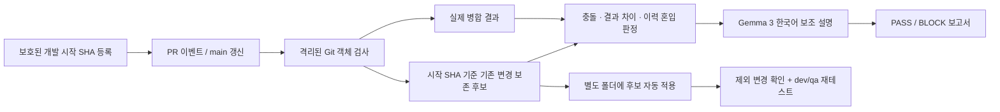

# PR Integrity Agent · Git + Gemma 3

`main`에서 시작한 개발 브랜치를 `dev`·`qa`로 테스트한 후 `main`에 반영할 때, 기존 변경을 원복하거나 다른 개발 이력을 섞는 위험을 검사합니다. Python 표준 라이브러리만 사용하므로 `pip install` 없이 폐쇄망에서 실행됩니다.

**현재 제공 범위:** 로컬 CLI, Git 이력 기반 검사, Ollama/Gemma 3 보조 설명, JSON/Markdown/HTML 보고서, 보존 후보 자동 적용, GitHub Enterprise Server 자체 호스팅 Runner용 연동 템플릿. 실제 사내 GitHub 및 실제 Gemma 추론 검증은 설치 후 수행해야 합니다.

## 동작 원리



Git은 오래된 브랜치라도 공통 조상으로 3-way merge를 하므로, 동일 파일의 독립적인 변경은 보통 함께 보존됩니다. 사고는 오래된 파일 복사, 잘못된 충돌 해결, dev/qa 역병합, 의도하지 않은 revert 등으로 발생할 수 있습니다.

현재 merge-base만 사용하면 이미 main을 합친 뒤 발생한 원복을 놓칠 수 있어 **개발을 시작한 SHA를 유지**합니다. 실제 병합 결과와 시작 SHA 기준 보존 결과가 다르면 차단합니다. 의도적인 기존 코드 재수정도 차단될 수 있으므로, `BLOCK`은 결함 확정이 아니라 검토 필요 판정입니다.

| 상황 | 결과 | 자동 처리 |
|---|---|---|
| 같은 파일의 서로 다른 구간 수정 | PASS | 양쪽 변경을 병합한 후보 |
| 같은 구간 수정 | BLOCK | 최신 대상 구간 유지 + 내 비충돌 구간 후보 |
| main 동기화 후 옛 파일로 덮어써 타인 내용 원복 | BLOCK | 원복 의심분을 제외한 후보 |
| 삭제/수정·복잡한 이름변경 충돌 | BLOCK | 구조적 충돌이 남으면 후보 없음 |
| 바이너리 충돌 | BLOCK | 대상 파일 전체 유지, PR 쪽 바이너리 변경 제외 |
| 등록되지 않은 작성자의 커밋 / 외부 브랜치 merge | BLOCK | 후보 없음 |
| 기준점 미등록·이력 단절 | BLOCK | 후보 없음 |
| Ollama 오류 | Git 판정 유지 | 설명에 연결 실패 표시 |

Gemma는 **Git 검사 결과를 설명**합니다. 원본 소스는 모델에 보내지 않고 판정 메타데이터/파일명만 로컬 Ollama에 전달합니다. 모델 출력으로 병합 여부나 코드를 결정하지 않습니다. 의미상 정합성, 기능 테스트, 작성자 신원, 동일 작성자가 복사하거나 cherry-pick한 타인의 코드를 완전히 증명하는 도구는 아닙니다.

## 빠른 재현

필요 환경: **Python 3.10 이상, Git 2.50 이상**. 테스트한 개발 환경은 Python 3.12 / Git 2.53 / Windows입니다. Linux Runner는 사내 적용 전 아래 테스트를 수행하세요. SHA-1 저장소를 지원하며 SHA-256 저장소는 지원하지 않습니다.

```powershell
git clone https://github.com/changqoo/20260921_github_check.git
cd 20260921_github_check
python -m unittest discover -v
python scripts/demo.py
```

`demo-output/report/report.html`을 열면 B 개발자가 A 내용을 원복한 예제의 `BLOCK` 보고서를 볼 수 있습니다. 데모는 기존 경로를 덮어쓰지 않으므로 재실행 시 `python scripts/demo.py demo-output-2`처럼 새 경로를 지정합니다.

## 개발 시작과 검사

다음 명령은 agent 프로젝트 폴더에서 실행합니다. `--repo`에 실제 검사할 Git 저장소 경로를 넣으세요. 서버 운영에서는 관리자가 별도 보호 저장소에 baseline을 등록합니다.

```powershell
# 개발 브랜치를 최신 main에서 만든 직후, 개발 커밋 전
# 실제 저장소에서는: git fetch origin; git switch -c feature/login origin/main
python -m prguard register --repo C:/work/product --main origin/main --head feature/login --repository MY_ORG/product --branch feature/login --owner developer@company.example --registry C:/prguard-baselines
# 위 명령이 출력한 JSON 경로를 다음 --baseline 값으로 사용

python -m prguard check --repo C:/work/product --base origin/main --head feature/login --repository MY_ORG/product --branch feature/login --baseline C:/prguard-baselines/PRINTED_HASH.json --out reports/check-001
```

명령 종료 코드: `0` = PASS, `2` = BLOCK, `3` = 실행 오류. `check`는 원본 checkout/index/브랜치를 변경하지 않습니다. 보고서 폴더는 새 경로만 받습니다. 원격 최신 상태는 먼저 `git fetch origin`으로 갱신하세요.

Gemma 3를 사용하려면 `config.example.json`을 `config.local.json`으로 복사한 후:

```powershell
ollama pull gemma3:4b
python -m prguard check --repo C:/work/product --base origin/main --head feature/login --repository MY_ORG/product --branch feature/login --baseline C:/prguard-baselines/PRINTED_HASH.json --out reports/check-002 --llm --config config.local.json
```

`ollama pull`은 외부망 준비 PC에서만 사용합니다. 사내망 모델 반입 절차는 [배포 가이드](docs/OFFLINE_DEPLOYMENT.md)를 보세요. `gemma3:4b`는 시작용 기본값이며 장비에 맞춰 크기/양자화 태그를 확정해야 합니다.

## 충돌 부분을 제외하고 자동 적용

```powershell
python -m prguard prepare --repo C:/work/product --base origin/main --head feature/login --report reports/check-002 --dest C:/work/product-candidate-001
```

`prepare`는 **새 독립 작업 폴더**를 만들고, 최신 대상 SHA 위에 검증된 후보를 적용하여 stage합니다. 원본 개발 폴더는 유지합니다. base/head SHA나 패치 checksum이 달라졌으면 중단합니다. 자동 커밋·푸시·main 병합은 수행하지 않습니다.

충돌 구간은 대상(main/qa/dev) 내용을 유지합니다. Git 충돌 hunk 단위이므로 바로 인접한 수정도 같이 제외될 수 있습니다. 보고서와 `candidate.patch`, 존재한다면 `excluded.patch`를 검토하고 dev/qa에서 다시 테스트하세요. `excluded.patch`는 **정상 병합이 가능할 때** 보존 후보와 실제 결과의 차이이며, 실제 충돌의 완전한 제외 hunk 목록은 아닙니다. 직접 충돌은 `origin_conflicts` 파일과 원본 PR diff를 함께 확인합니다.

## 문서

- [사내망 반입 · 개인 GitHub 업로드 · 설치](docs/OFFLINE_DEPLOYMENT.md)
- [브랜치 운영 · baseline 등록 · 의도적인 기존 코드 수정](docs/OPERATIONS.md)
- [구조 · 판정 범위 · 안전 경계](docs/ARCHITECTURE.md)
- [필수 설정 및 인수 테스트](docs/ACCEPTANCE.md)
- [GitHub Enterprise 연동 템플릿](deploy/pr-integrity.internal.yml)

사내 템플릿은 `deploy/`에 보관합니다. 개인 GitHub에 올려도 사내 Runner에 자동 연결되지 않습니다.
